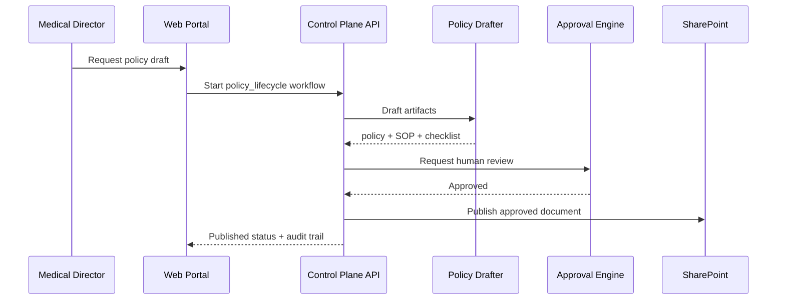
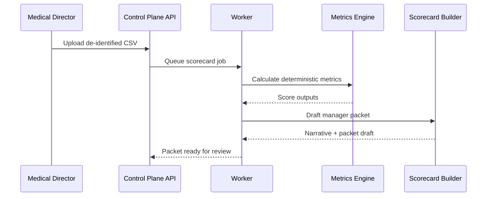

# Sequence diagrams

## Policy publication flow

```mermaid
sequenceDiagram
  participant User as Medical Director
  participant Web as Web Portal
  participant API as Control Plane API
  participant Agent as Policy Drafter
  participant Approval as Approval Engine
  participant SP as SharePoint

  User->>Web: Request policy draft
  Web->>API: Start policy_lifecycle workflow
  API->>Agent: Draft artifacts
  Agent-->>API: policy + SOP + checklist
  API->>Approval: Request human review
  Approval-->>API: Approved
  API->>SP: Publish approved document
  API-->>Web: Published status + audit trail
```

## Scorecard generation flow

```mermaid
sequenceDiagram
  participant User as Medical Director
  participant API as Control Plane API
  participant Worker as Worker
  participant Metrics as Metrics Engine
  participant Agent as Scorecard Builder

  User->>API: Upload de-identified CSV
  API->>Worker: Queue scorecard job
  Worker->>Metrics: Calculate deterministic metrics
  Metrics-->>Worker: Score outputs
  Worker->>Agent: Draft manager packet
  Agent-->>Worker: Narrative + packet draft
  Worker-->>API: Packet ready for review
```
